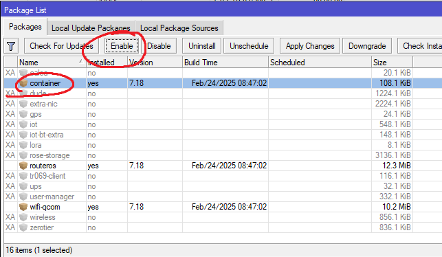
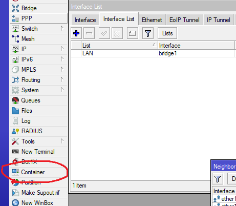
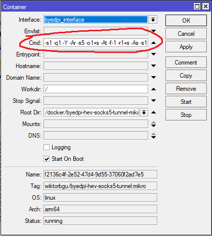

# Mikrotik-Byedpi-Youtube-instruction
Инструкция для установки контейнера с byedpi для обхода блокировки Youtube

Данная инструкция работает для микротиков на arm, arm64 процах с RoS 7.19beta6 и выше

Локальный интерфейс (чаще всего это bridge1 или bridge_local) добавьте в interface-list "LAN", так придется меньше адаптировать инструкцию под свой конфиг

### 1. Включим режим использования контейнеров на микротике
Посмотреть список режимов можно так: ``` /system/device-mode print ```

Включаем режим контейнера, за одно и генерации трафика, который может пригодиться, например для этой инструкции: [wiktorbgu/Mikrotik WireGuard anti DPI.md](https://gist.github.com/wiktorbgu/1f2dfe99837d8f2803483be95814d2e5)

Команда включения: ``` /system/device-mode/update container=yes traffic-gen=yes ```

После включения нужно ребутнуть микрот по питанию, либо физической кнопкой ресет. Программный ребут не сработает, режим не переключится. 
[Официальная справка по device-mode](https://help.mikrotik.com/docs/display/ROS/Device-mode).

Убедимся, что режимы включились: ``` /system/device-mode print ```

### 2. Устанавливаем модуль для работы с контейнерами
Заходим в System - Packages и смотрим, если модуль присутствует, включаем его кнопкой Enable: 



Осталось отправить микротик на ребут.

Если модуль контейнера установился, в главном меню появиться пункт: 



### 3. Создаем интерфейс для будущего контейнера
Тут всё просто: делаем интерфейс и сразу задаем будущему контейнеру ip адрес: 

``` /interface veth add address=192.168.254.2/30 gateway=192.168.254.1 name=byedpi_interface ```

На другом конце интерфейса задаем ip адрес нашему микротику: 

``` /ip address add address=192.168.254.1/30 disabled=no interface=byedpi_interface ```

### 3. Загружаем контейнер byedpi-hev-socks5-tunnel
Заливаем на свой микрот свежий контейнер от Виктора: [Полезные контейнеры для Mikrotik](https://teletype.in/@wiktorbgu/containers-mikrotik)

```
/container config set registry-url=https://registry-1.docker.io tmpdir=docker
/container/add remote-image=wiktorbgu/byedpi-hev-socks5-tunnel:mikro interface=byedpi_interface cmd="-s1 -q1 -Y -Ar -s5 -o1+s -At -f-1 -r1+s -As -s1 -o1 +s -s-1 -An -b+500" root-dir=/docker/byedpi-hev-socks5-tunnel-mikro start-on-boot=yes
```
Контейнер ляжет на внутреннюю флеш память микротика, в папку /docker, если хотите (или на вашем микроте нет свободного места), можно записать его на флешку, для этого подправьте путь в переменной root-dir=/usb1/docker...

Обратите внимание на переменную cmd="-s1 -q1 -Y -Ar -s5 -o1+s -At -f-1 -r1+s -As -s1 -o1 +s -s-1 -An -b+500" именно она задает параметры работы byedpi контейнера. После установки можно ее отредактировать, например, если у вашего провайдера данные параметры работают плохо.

Редактируется эта переменная в свойствах контейнера через winbox: 



Разные ключи для подбора можно взять вот отсюда: https://raw.githubusercontent.com/romanvht/ByeDPIAndroid/refs/heads/master/app/src/main/assets/proxytest_cmds.txt

Также можно полазить на форумах, в обсуждениях репозитория byedpi, а еше спросить в телеграм канале: https://t.me/it_network_people

### 4. Создаем таблицу роутинга и прописываем маршрут до byedpi контейнера

```
/routing/table add disabled=no fib name=byedpi_table
/ip route add dst-address=0.0.0.0/0 gateway=192.168.254.2 routing-table=byedpi_table
```

### 5. Делаем настройки DNS для форварда
Поскольку РКН активно начал блокировать DoH протокол, не советую использовать его для всего трафика, а только для доменов, которым требуется обход блокировки. К тому-же DoH работает гораздо медленнее классического DNS, и бывает подлагивает, если использовать на постоянку.

Ниже приведен пример с CloudFlare сервером, но Вы можете выбрать другой, менее популярный.

Добавляем форвард DoH сервер, он будет обрабатывать только те запросы, которые мы отправим, остальные запросы будут обрабатываться стандартными настройками, прописанными в IP - DNS: 

``` /ip/dns/forwarders add doh-servers="https://dns.quad9.net/dns-query" name="DoH" ```

### 6. Создаем список доменов для обхода блокировки

Список доменов для обхода блокировки собирал сам, некоторые правила могут дублировать друг друга, больно за него не бейте..

Для доменов из этого списка DNS будет резолвиться из DoH сервера, прописанного в #5 правиле. Все ip адреса в результате резолвинга будут попадать в address-list фаервола "byedpi_list".


<details>
<summary>Заполняем DNS Static</summary>
  
```
/ip dns static
add address-list=byedpi_list forward-to="DoH" match-subdomain=yes name=amnezia.org type=FWD
add address-list=byedpi_list forward-to="DoH" match-subdomain=yes name=1e100.net type=FWD
add address-list=byedpi_list forward-to="DoH" match-subdomain=yes name=1e100.app type=FWD
add address-list=byedpi_list forward-to="DoH" match-subdomain=yes name=1e100.org type=FWD
add address-list=byedpi_list forward-to="DoH" match-subdomain=yes name=googlevideo.com type=FWD
add address-list=byedpi_list forward-to="DoH" match-subdomain=yes name=googletagmanager.com type=FWD
add address-list=byedpi_list forward-to="DoH" match-subdomain=yes name=youtube.com type=FWD
add address-list=byedpi_list forward-to="DoH" match-subdomain=yes name=ytimg.com type=FWD
add address-list=byedpi_list forward-to="DoH" match-subdomain=yes name=youtu.be type=FWD
add address-list=byedpi_list forward-to="DoH" match-subdomain=yes name=ggpht.com type=FWD
add address-list=byedpi_list forward-to="DoH" match-subdomain=yes name=facebook.com type=FWD
add address-list=byedpi_list forward-to="DoH" match-subdomain=yes name=flibusta.is type=FWD
add address-list=byedpi_list forward-to="DoH" match-subdomain=yes name=bbc.com type=FWD
add address-list=byedpi_list forward-to="DoH" match-subdomain=yes name=bbci.co.uk type=FWD
add address-list=byedpi_list forward-to="DoH" match-subdomain=yes name=fbcdn.net type=FWD
add address-list=byedpi_list forward-to="DoH" match-subdomain=yes name=ntc.party type=FWD
add address-list=byedpi_list forward-to="DoH" match-subdomain=yes name=yt.be type=FWD
add address-list=byedpi_list forward-to="DoH" match-subdomain=yes name=youtubeeducation.com type=FWD
add address-list=byedpi_list forward-to="DoH" match-subdomain=yes name=youtubekids.com type=FWD
add address-list=byedpi_list forward-to="DoH" match-subdomain=yes name=youtube-nocookie.com type=FWD
add address-list=byedpi_list forward-to="DoH" match-subdomain=yes name=youtubefanfest.com type=FWD
add address-list=byedpi_list forward-to="DoH" match-subdomain=yes name=youtubegaming.com type=FWD
add address-list=byedpi_list forward-to="DoH" match-subdomain=yes name=youtubego.com type=FWD
add address-list=byedpi_list forward-to="DoH" match-subdomain=yes name=youtubemobilesupport.com type=FWD
add address-list=byedpi_list forward-to="DoH" match-subdomain=yes name=withyoutube.com type=FWD
add address-list=byedpi_list forward-to="DoH" match-subdomain=yes name=googleusercontent.com type=FWD
add address-list=byedpi_list forward-to="DoH" match-subdomain=yes name=googleapis.com type=FWD
add address-list=byedpi_list forward-to="DoH" match-subdomain=yes name=gvt1.com type=FWD
add address-list=byedpi_list forward-to="DoH" match-subdomain=yes name=nhacmp3youtube.com type=FWD
add address-list=byedpi_list forward-to="DoH" match-subdomain=yes name=nnmclub.to type=FWD
add address-list=byedpi_list forward-to="DoH" match-subdomain=yes name=reddit.com type=FWD
add address-list=byedpi_list forward-to="DoH" match-subdomain=yes name=citricmedia.co.uk type=FWD
add address-list=byedpi_list forward-to="DoH" match-subdomain=yes name=google.com type=FWD
add address-list=byedpi_list forward-to="DoH" match-subdomain=yes name=rutracker.cc type=FWD
add address-list=byedpi_list forward-to="DoH" match-subdomain=yes name=x.com type=FWD
add address-list=byedpi_list forward-to="DoH" match-subdomain=yes name=gstatic.com type=FWD
add address-list=byedpi_list forward-to="DoH" match-subdomain=yes name=aws-prd.net type=FWD
add address-list=byedpi_list forward-to="DoH" match-subdomain=yes name=lgappstv.com type=FWD
add address-list=byedpi_list forward-to="DoH" match-subdomain=yes name=lgeapi.com type=FWD
add address-list=byedpi_list forward-to="DoH" match-subdomain=yes name=lgsmartad.com type=FWD
add address-list=byedpi_list forward-to="DoH" match-subdomain=yes name=lgtvsdp.com type=FWD
add address-list=byedpi_list forward-to="DoH" match-subdomain=yes name=lge.com type=FWD
add address-list=byedpi_list forward-to="DoH" match-subdomain=yes name=googleapi.com type=FWD
add address-list=byedpi_list forward-to="DoH" match-subdomain=yes name=rutracker.org type=FWD
add address-list=byedpi_list forward-to="DoH" match-subdomain=yes name=t.co type=FWD
add address-list=byedpi_list forward-to="DoH" match-subdomain=yes name=twtrdns.net type=FWD
add address-list=byedpi_list forward-to="DoH" match-subdomain=yes name=twitter.co type=FWD
add address-list=byedpi_list forward-to="DoH" match-subdomain=yes name=twitpic.com type=FWD
add address-list=byedpi_list forward-to="DoH" match-subdomain=yes name=twitterinc.com type=FWD
add address-list=byedpi_list forward-to="DoH" match-subdomain=yes name=twitteroauth.com type=FWD
add address-list=byedpi_list forward-to="DoH" match-subdomain=yes name=twitterstat.us type=FWD
add address-list=byedpi_list forward-to="DoH" match-subdomain=yes name=twitter.com type=FWD
add address-list=byedpi_list forward-to="DoH" match-subdomain=yes name=goo.gl type=FWD
add address-list=byedpi_list forward-to="DoH" match-subdomain=yes name=google.ru type=FWD
add address-list=byedpi_list forward-to="DoH" match-subdomain=yes name=twimg.com type=FWD
```
</details>

Вот эта команда не позволит быстро очищаться адрес-листам в фаерволе: ``` /ip/dns set address-list-extra-time=1d ```

### 6. Создаем правила на фаерволе
Для начала отключим fastrack для маркированного трафика

```
/ip firewall filter set [find action=fasttrack-connection] packet-mark=no-mark connection-mark=no-mark
```

Это правило будет отправлять трафик, предназначенный для ip адресов из таблицы фаервола "byedpi_list" в таблицу маршрутизации "byedpi_table"

```
/ip firewall mangle add action=mark-routing chain=prerouting dst-address-list=byedpi_list dst-port=80,443 in-interface-list=LAN new-routing-mark=byedpi_table passthrough=no protocol=tcp
```

Следующие два правила разрешают трафику из сетей LAN ходить на интерфейс byedpi контейнера, а с интерфейса контейнера ходить в интернет. 

```
/ip firewall filter
add action=accept chain=forward comment="LAN to ByeDPI container" in-interface-list=LAN out-interface=byedpi_interface protocol=tcp dst-port=80,443
add action=accept chain=forward comment="ByeDPI container to Internet" in-interface=byedpi_interface out-interface-list=WAN  protocol=tcp dst-port=80,443
```

Не забываем, что после ввода команд правила появляются в самом низу списка, их нужно ручками перетащить повыше, для этого зайти через Winbox на IP - Firewall - Filter.

Далее правило позволяющее работать ютубу на телевизорах Samsung, LG и т.п.. некоторые пользователи жалуются что ютуб начинает работать чуть медленнее, по этому если нет телека, то правило лучше не использовать:
```
/ip firewall mangle add action=change-mss chain=forward new-mss=88 protocol=tcp dst-port=80,443 src-address=192.168.254.2 tcp-flags=syn
```

### 7. Запретим DNS трафик из вашей локальной сети в обход роутера
Если вдруг какое-то из устройств локальной сети решит использовать собственный DNS сервер, то DNS запросы пойдут мимо вашего роутера, статическая таблица DNS не будет отправлять ip адреса в firewall address-list и правила обхода окажутся бесполезными. По этому в обязательном порядке нужно включить DNS редирект всех запросов из локальной сети:

```
/ip firewall nat
add action=redirect chain=dstnat comment="dns redirect" dst-port=53 in-interface-list=LAN protocol=udp
add action=redirect chain=dstnat comment="dns redirect" dst-port=53 in-interface-list=LAN protocol=tcp
```

Ну и для особо подозрительных админов, есть инструкция как блокировать DoH и DoQ запросы из локальной сети, я лично использую везде для более эффективной работы обхода блокировок: 
[skylevels/Mikrotik-disable-DoH-and-DoQ-instruction](https://github.com/skylevels/Mikrotik-disable-DoH-and-DoQ-instruction)

### 8. Конец
Тут нужно написать лирическое отступление и подвести итог, но мне пока лень
