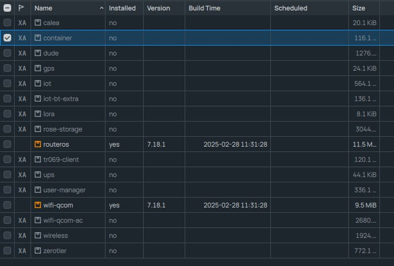

# Mikrotik-Byedpi-Youtube-instruction
Инструкция для установки контейнера с byedpi для обхода блокировки Youtube

Данная инструкция работает для микротиков на arm, arm64 процах, с RoS 7.18 и выше
Правила даны не только для ipv4 но и для ipv6 протоколов, если Вы не используете ipv6, то вводить команды с пометкой #for_ipv6 не нужно.

Локальный интерфейс (чаще всего это bridge1 или bridge_local) добавьте в interface-list "LAN", так придется меньше адаптировать инструкцию под свой конфиг

### 1. Включим режим использования контейнеров на микротике
Посмотреть список режимов можно так: ``` /system/device-mode print ```

Включаем режим контейнера, за одно и генерации трафика, который может пригодиться для этой инструкции: [wiktorbgu/Mikrotik WireGuard anti DPI.md](https://gist.github.com/wiktorbgu/1f2dfe99837d8f2803483be95814d2e5)

Команда включения: ``` /system/device-mode/update container=yes traffic-gen=yes ```

После включения нужно ребутнуть микрот по питанию, либо физической кнопкой ресет. Программный ребут не сработает, режим не переключится. 
[Официальная справка по device-mode](https://help.mikrotik.com/docs/display/ROS/Device-mode).

Убедимся, что режимы включились: ``` /system/device-mode print ```

### 2. Устанавливаем модуль для работы с контейнерами
На некоторых прошивках модуль автоматически загружается в микротик при включении режимов.
Заходим в System - Packages и смотрим (Олды, не пугайтесь, именно так выглядит интерфейс нового WinBox): 
Тут осталось только включить контейнер и отправить микротик на ребут

Если же модуль не загрузился, загрузим его вручную командой (только версию своей прошивки подправьте, если у вас другая): 

Для arm64: ```/tool fetch https://upgrade.mikrotik.com/routeros/7.18.1/container-7.18.1-arm64.npk ```

Для arm ``` /tool fetch https://upgrade.mikrotik.com/routeros/7.18.1/container-7.18.1-arm.npk ```

После установки контейнера не забудте сделать ребут. Когда контейнер встал, в главном меню появиться пункт: 

### 3. 


### X. Запретим DNS трафик из вашей локальной сети в обход роутера
```
/ip firewall nat
 add action=redirect chain=dstnat comment="dns redirect" dst-port=53 in-interface-list=LAN protocol=udp
add action=redirect chain=dstnat comment="dns redirect" dst-port=53 in-interface-list=LAN protocol=tcp

#for_ipv6
/ipv6 firewall nat
add action=redirect chain=dstnat comment="dns redirect" dst-port=53 in-interface-list=LAN protocol=tcp
add action=redirect chain=dstnat comment="dns redirect" dst-port=53 in-interface-list=LAN protocol=udp
```

